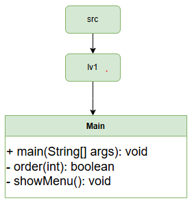
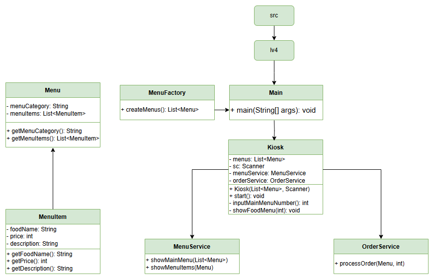

# Java Kiosk 프로젝트

본 프로젝트는 Java의 객체지향 프로그래밍(OOP) 원칙을 바탕으로 콘솔 기반 키오스크 시스템을 구현한 과제입니다.  
클래스 분리, 캡슐화, Enum, 스트림 등 자바의 다양한 기능을 실제 프로젝트에 적용하여 구조적이고 유지보수 가능한 코드를 목표로 개발했습니다.

## 프로젝트 개요

- 과제명: 키오스크 구현
- 기간: 2025.04.24 ~ 2025.05.01
- 환경: Java 17, IntelliJ IDEA

# Git 컨벤션
- `feat`: 새로운 기능 추가

- `fix`: 버그 수정

- `refactor`: 	코드 리팩토링 (기능 변화 없이 구조 개선)

- `docs`: 문서 수정 (README, 주석 등)

- `chore`: 기타 설정, 빌드, 패키지 등

## 기능 구현

### 필수 기능

| 단계 | 기능 내용 | 완료 여부 |
|------|-----------|------------|
| Lv1  | Scanner를 이용한 햄버거 메뉴 출력 및 선택 | ✅ |
| Lv2  | MenuItem 클래스를 이용한 햄버거 객체 생성 및 List로 관리 | ✅ |
| Lv3  | Kiosk 클래스를 통한 흐름 제어(start 메서드 구현) | ✅ |
| Lv4  | Menu 클래스를 통한 메뉴 카테고리 분리 (Burger, Drink 등) | ✅ |
| Lv5  | 필드 캡슐화 및 Getter/Setter 사용 | ✅ |

### 도전 기능

| 단계 | 기능 내용 | 완료 여부 |
|------|-----------|------------|
| Lv1  | 장바구니 기능, 주문 및 결제 처리 | ✅ |
| Lv2  | Enum을 통한 할인율 관리, 스트림/람다를 통한 장바구니 처리 | ✅ |

## 클래스 다이어그램

Lv1

Lv2

Lv3

Lv4

ChallengeLv1

ChallengeLv2

## 주요 클래스 설명

- `MenuItem`: 음식의 이름, 가격, 설명 정보를 포함
- `Menu`: 하나의 메뉴 카테고리(Burger, Drink 등)를 담당하며, 여러 MenuItem 보유
- `Kiosk`: 프로그램 전체 흐름을 담당. 사용자 입력, 메뉴 출력, 장바구니 제어
- `CartService`: 장바구니에 항목 추가, 취소, 총액 계산
- `OrderService`: 주문 확인 및 할인 적용
- `UserType (Enum)`: 할인율이 포함된 사용자 타입 정의 (군인, 학생 등)
- `MenuFactory` : 전체 메뉴(버거, 음료, 디저트 등)의 초기 구성을 담당하는 팩토리 클래스. Menu 객체들을 생성하여 Kiosk에 전달합니다.
- `MenuService` : 메뉴 출력 및 사용자 선택 기능을 분리하여 담당. 메뉴 카테고리 출력, 해당 메뉴 내 항목 선택 처리 등 View 관련 흐름을 구성합니다.
- `InputException` : 유효하지 않은 사용자 입력에 대해 던져지는 커스텀 예외 클래스. 예외 메시지를 통해 입력 유효성 문제를 명확히 알립니다.
- `ExceptionHandler` : 사용자 입력 시 발생할 수 있는 InputException 등을 처리하여, 에러 메시지를 출력하고 프로그램이 정상 흐름을 유지할 수 있도록 돕습니다.

## 실행 예시

### 1. 메인메뉴 출력 화면 
### - 사용자는 메인 메뉴(버거, 음료 등)에서 원하는 항목을 선택합니다.

### 2. 선택한 카테고리의 상세 메뉴 출력 화면
### - 선택한 카테고리(Burgers 등)의 MenuItem 목록이 출력됩니다.

### 3. 메뉴 상세 정보 확인 화면
### - 선택한 메뉴의 이름, 가격, 설명을 확인하고, 장바구니에 추가 여부를 선택합니다.

### 4. 수량 입력 화면
### - 추가를 선택한 경우, 원하는 수량을 입력합니다.

### 5. 장바구니 기능 활성화
### - 장바구니에 항목이 추가되면 [ORDER MENU]가 나타납니다. (주문 / 주문 취소)

### 6. 장바구니 목록 및 결제 전 확인
### - 장바구니 내용을 출력하며 총 금액을 계산하고, 주문 여부를 확인합니다.

### 7. 할인 정보 선택 화면
### - 주문을 선택하면 사용자 할인 유형을 선택할 수 있습니다. (군인, 학생, 일반 등)

### 8. 할인 적용 및 주문 완료
### - 선택한 할인율이 적용된 최종 금액이 출력되며, 주문 완료 후 장바구니가 초기화됩니다.

